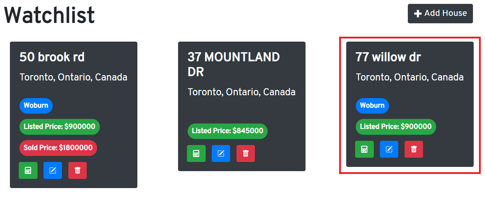
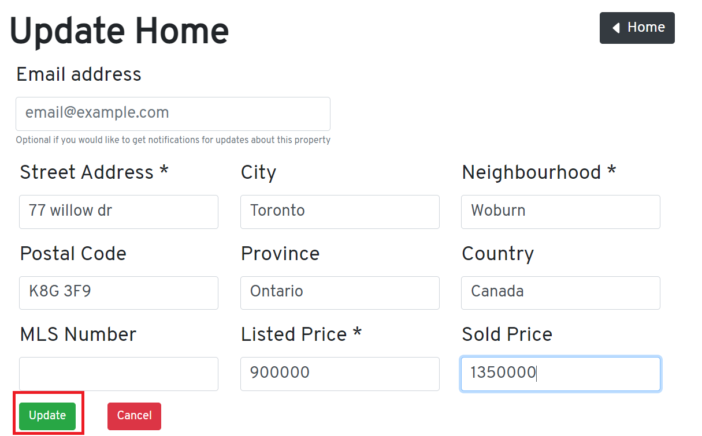
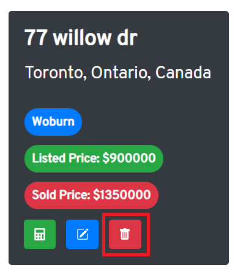
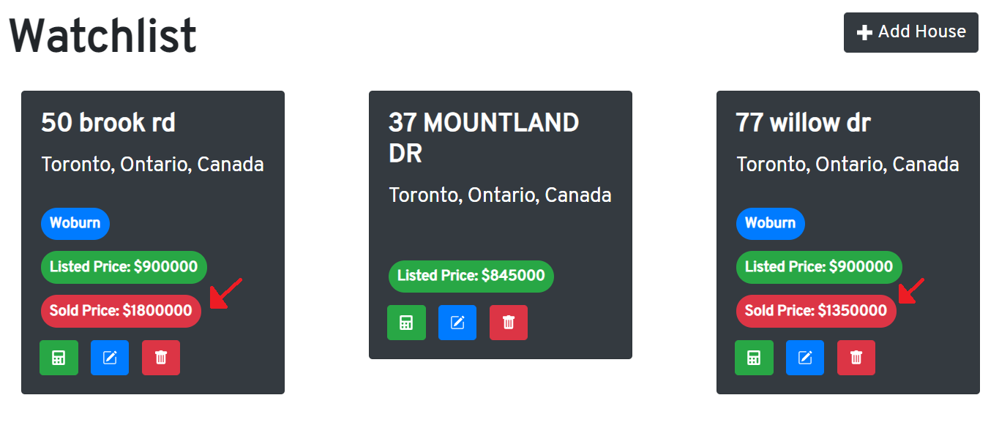

# **Homesearch**
This application is to help users who are in the market for a house to keep track of houses they like and also keep track of the average price that the houses in their desired area are being sold at. Users can add, update and remove houses that are in their watch list. They can add the address with the neighbourhood the house is in and the listed price and sold price with it. An user can also add a house through its MLS number if they know the MLS number which is assigned to each property. Additionally, if a house is sold after they added it to their watchlist, they can update the house's information with the sold price. A key feature of this application is the ability to show the average price of houses in a neighbourhood and this depends on the price that houses in the watchlist were sold at in the particular neighbourhood. An average price will only be shown if at least house in the neighbourhood has been sold. The application also enables a user to calculate the mortage for a house. The application was developed using **MongoDB**, **Express.js**, **React.js** and **Node.js**.

## **How is works**

### *Adding a property to the watchlist*
**Step 1**: Click the ‘Add House’ button on the homepage to go to the add home page.

  

**Step 2**: Add the information into the input fields (Street Address, Neighbourhood and Listed Price are required fields). If you would like to get emails like when the property has been added to your watchlist, if its been updated or deleted from your watchlist then enter your email address in the 'Email Address' field. Then click the ‘Create’ button and a success message should show up at the top right hand corner of the page indicating the the property was added, then after click the ‘Home’ button.

  

**The property will be added to your watchlist**

#### You can also add houses by searching a houses MLS number:
**Step 1**: Click the ‘Add By MLS #’ link on the navigation bar.  

  

**Step 2**: Enter the MLS number of the house you would like to add and click the blue search button and if a house with the MLS number exists, it will show up in the results. Then to add the house, click the 'Add' button on the houses card.  

  

**The property will be added to your watchlist**  

  

  

### *Updating a property*
**Step 1**: Click on the blue update button on the card with the home to be edited and it should take the user to the update home page.  

  

**Step 2**: Update anything you would like to update and click the ‘Update’ button. A success message should show up at the top right hand corner of the page indicating the home was updated and then click on the ‘Home’ button to go back to the home page.  

  

**The updates should be seen in the home page**  

  

### *Deleting a property*
**Step 1**: Navigate to the home page, in the card that has the home to delete, click the red button with the trash icon.  

  

**The property should be deleted and cannot be seen in the watchlist**
  

### *Checking the average of a neighbourhood*
**For a average house price in a neighbourhood to be shown, make sure the houses in the neighbourhood have a sold price**

**Step 1**: Check if houses in the neighbourhood have a price at which they were sold at.

  

**Step 2**: Navigate to the Average Price page by clicking on the 'Average Price' link in the navigation bar.

**Step 3:** In the 'Average Price' page, click on the 'Neighbourhood' dropdown and select a neighbourhood.  

  

**Average price will be shown if there were houses sold in the neighbourhood**

 

### *Calculating the mortage for a house*
**Step 1**: Click on the calculate button on the card of a house.

 

**Step 1**: By default, the frequency of payments is 12 months, pricipal value will be set to the listed price of the home, interest rate will be 5% and amortization period will be 25 years but you can change that according to your preferences and click 'Calculate' and you will be shown the monthly mortage. 

  